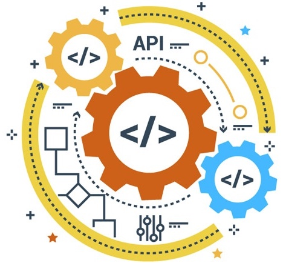

原文链接：<a href="http://qt-project.org/wiki/API-Design-Principles">API Design Principles</a> - <a href="http://wiki.qt.io/">QT Wiki</a> 基于<a href="http://blog.csdn.net/gaoyingju">Gary的影响力</a>上 <em>Gary Gao</em> 的译文稿：<a href="http://blog.csdn.net/gaoyingju/article/details/8245108"><code>C++</code>的<code>API</code>设计指导</a> 译文发在<a href="http://coolshell.cn/">酷壳 - CoolShell</a>：<a href="http://coolshell.cn/articles/18024.html"><code>API</code>设计原则</a>， 2017-07-25

<a href="https://github.com/oldratlee/translations/blob/master/api-design-principles-from-qt/README.md">GitHub</a>

<h2 id="-apple-">:apple: 译序</h2>

<code>Qt</code>的设计水准在业界很有口碑，一致、易于掌握和强大的<code>API</code>是<code>Qt</code>最著名的优点之一。此文既是<code>Qt</code>官网上的<code>API</code>设计指导准则，也是<code>Qt</code>在<code>API</code>设计上的实践总结。虽然<code>Qt</code>用的是<code>C++</code>，但其中设计原则和思考是具有普适性的（如果你对<code>C++</code>还不精通，可以忽略与<code>C++</code>强相关或是过于细节的部分，仍然可以学习或梳理关于<code>API</code>设计最有价值的内容）。整个篇幅中有很多示例，是关于<code>API</code>设计一篇难得的好文章。

需要注意的是，这篇<code>Wiki</code>有一些内容并不完整，所以，可能会有一些阅读上的问题，我们对此做了一些相关的注释。

感谢<a href="http://coolshell.cn/">酷壳</a>博主 <a href="http://weibo.com/haoel">陈皓</a>的全文审校，并对难点和要注意的地方给出贴心的说明和译注。

<h1 id="-api-"><code>API</code>设计原则</h1>

一致、易于掌握和强大的<code>API</code>是<code>Qt</code>最著名的优点之一。此文总结了我们在设计<code>Qt</code>风格<code>API</code>的过程中所积累的诀窍（<code>know-how</code>）。其中许多是通用准则；而其他的则更偏向于约定，遵循这些约定主要是为了与已有的<code>API</code>保持一致。

虽然这些准则主要用于对外的<code>API</code>（<code>public API</code>），但在设计对内的<code>API</code>（<code>private API</code>）时也推荐遵循相同的技巧（<code>techniques</code>），作为开发者之间协作的礼仪（<code>courtesy</code>）。

如有兴趣也可以读一下 <em>Jasmin Blanchette</em> 的<a href="http://www4.in.tum.de/~blanchet/api-design.pdf">Little Manual of API Design (PDF)</a> 或是本文的前身 <em>Matthias Ettrich</em> 的<a href="https://doc.qt.io/archives/qq/qq13-apis.html">Designing Qt-Style C++ APIs</a>。

<!-- START doctoc generated TOC please keep comment here to allow auto update -->
<!-- DON'T EDIT THIS SECTION, INSTEAD RE-RUN doctoc TO UPDATE -->
<ul>
<li><a href="#1-%E5%A5%BDapi%E7%9A%846%E4%B8%AA%E7%89%B9%E8%B4%A8">1. 好<code>API</code>的6个特质</a><ul>
<li><a href="#11-%E6%9E%81%E7%AE%80">1.1 极简</a></li>
<li><a href="#12-%E5%AE%8C%E5%A4%87">1.2 完备</a></li>
<li><a href="#13-%E8%AF%AD%E4%B9%89%E6%B8%85%E6%99%B0%E7%AE%80%E5%8D%95">1.3 语义清晰简单</a></li>
<li><a href="#14-%E7%AC%A6%E5%90%88%E7%9B%B4%E8%A7%89">1.4 符合直觉</a></li>
<li><a href="#15-%E6%98%93%E4%BA%8E%E8%AE%B0%E5%BF%86">1.5 易于记忆</a></li>
<li><a href="#16-%E5%BC%95%E5%AF%BCapi%E4%BD%BF%E7%94%A8%E8%80%85%E5%86%99%E5%87%BA%E5%8F%AF%E8%AF%BB%E4%BB%A3%E7%A0%81">1.6 引导<code>API</code>使用者写出可读代码</a></li>
</ul>
</li>
<li><a href="#2-%E9%9D%99%E6%80%81%E5%A4%9A%E6%80%81">2. 静态多态</a><ul>
<li><a href="#21-%E5%A5%BD%E7%9A%84%E6%A1%88%E4%BE%8B">2.1 好的案例</a></li>
<li><a href="#22-%E5%B7%AE%E7%9A%84%E6%A1%88%E4%BE%8B">2.2 差的案例</a></li>
<li><a href="#23-%E5%80%BC%E5%BE%97%E6%96%9F%E9%85%8C%E7%9A%84%E6%A1%88%E4%BE%8B">2.3 值得斟酌的案例</a></li>
</ul>
</li>
<li><a href="#3-%E5%9F%BA%E4%BA%8E%E5%B1%9E%E6%80%A7%E7%9A%84api">3. 基于属性的<code>API</code></a></li>
<li><a href="#4-c%E7%9B%B8%E5%85%B3">4. <code>C++</code>相关</a><ul>
<li><a href="#41-%E5%80%BC-vs-%E5%AF%B9%E8%B1%A1">4.1 值 vs. 对象</a><ul>
<li><a href="#411-%E6%8C%87%E9%92%88-vs-%E5%BC%95%E7%94%A8">4.1.1 指针 vs. 引用</a></li>
<li><a href="#412-%E6%8C%89%E5%B8%B8%E9%87%8F%E5%BC%95%E7%94%A8%E4%BC%A0%E5%8F%82-vs-%E6%8C%89%E5%80%BC%E4%BC%A0%E5%8F%82">4.1.2 按常量引用传参 vs. 按值传参</a></li>
</ul>
</li>
<li><a href="#42-%E8%99%9A%E5%87%BD%E6%95%B0">4.2 虚函数</a><ul>
<li><a href="#421-%E9%81%BF%E5%85%8D%E8%99%9A%E5%87%BD%E6%95%B0">4.2.1 避免虚函数</a></li>
<li><a href="#422-%E8%99%9A%E5%87%BD%E6%95%B0-vs-%E6%8B%B7%E8%B4%9D">4.2.2 虚函数 vs. 拷贝</a></li>
</ul>
</li>
<li><a href="#43-%E5%85%B3%E4%BA%8Econst">4.3 关于<code>const</code></a><ul>
<li><a href="#431-%E8%BE%93%E5%85%A5%E5%8F%82%E6%95%B0const%E6%8C%87%E9%92%88">4.3.1 输入参数：<code>const</code>指针</a></li>
<li><a href="#432-%E8%BF%94%E5%9B%9E%E5%80%BCconst%E5%80%BC">4.3.2 返回值：<code>const</code>值</a></li>
<li><a href="#433-%E8%BF%94%E5%9B%9E%E5%80%BC%E9%9D%9Econst%E7%9A%84%E6%8C%87%E9%92%88%E8%BF%98%E6%98%AF%E6%9C%89const%E7%9A%84%E6%8C%87%E9%92%88">4.3.3 返回值：非<code>const</code>的指针还是有<code>const</code>的指针</a></li>
<li><a href="#434-%E8%BF%94%E5%9B%9E%E5%80%BC%E6%8C%89%E5%80%BC%E8%BF%94%E5%9B%9E-%E8%BF%98%E6%98%AF-%E6%8C%89const%E5%BC%95%E7%94%A8%E8%BF%94%E5%9B%9E">4.3.4 返回值：按值返回 还是 按<code>const</code>引用返回？</a></li>
<li><a href="#445-const-vs-%E5%AF%B9%E8%B1%A1%E7%9A%84%E7%8A%B6%E6%80%81">4.4.5 <code>const</code> vs. 对象的状态</a></li>
</ul>
</li>
</ul>
</li>
<li><a href="#5-api%E7%9A%84%E8%AF%AD%E4%B9%89%E5%92%8C%E6%96%87%E6%A1%A3">5. <code>API</code>的语义和文档</a></li>
<li><a href="#6-%E5%91%BD%E5%90%8D%E7%9A%84%E8%89%BA%E6%9C%AF">6. 命名的艺术</a><ul>
<li><a href="#61-%E9%80%9A%E7%94%A8%E7%9A%84%E5%91%BD%E5%90%8D%E8%A7%84%E5%88%99">6.1 通用的命名规则</a></li>
<li><a href="#62-%E7%B1%BB%E7%9A%84%E5%91%BD%E5%90%8D">6.2 类的命名</a></li>
<li><a href="#63-%E6%9E%9A%E4%B8%BE%E7%B1%BB%E5%9E%8B%E5%8F%8A%E5%85%B6%E5%80%BC%E7%9A%84%E5%91%BD%E5%90%8D">6.3 枚举类型及其值的命名</a></li>
<li><a href="#64-%E5%87%BD%E6%95%B0%E5%92%8C%E5%8F%82%E6%95%B0%E7%9A%84%E5%91%BD%E5%90%8D">6.4 函数和参数的命名</a></li>
<li><a href="#65-%E5%B8%83%E5%B0%94%E7%B1%BB%E5%9E%8B%E7%9A%84getter%E4%B8%8Esetter%E6%96%B9%E6%B3%95%E7%9A%84%E5%91%BD%E5%90%8D">6.5 布尔类型的<code>getter</code>与<code>setter</code>方法的命名</a></li>
</ul>
</li>
<li><a href="#7-%E9%81%BF%E5%85%8D%E5%B8%B8%E8%A7%81%E9%99%B7%E9%98%B1">7. 避免常见陷阱</a><ul>
<li><a href="#71-%E7%AE%80%E5%8C%96%E7%9A%84%E9%99%B7%E9%98%B1">7.1 简化的陷阱</a></li>
<li><a href="#72-%E5%B8%83%E5%B0%94%E5%8F%82%E6%95%B0%E7%9A%84%E9%99%B7%E9%98%B1">7.2 布尔参数的陷阱</a></li>
</ul>
</li>
<li><a href="#8-%E6%A1%88%E4%BE%8B%E7%A0%94%E7%A9%B6">8. 案例研究</a><ul>
<li><a href="#81-qprogressbar">8.1 <code>QProgressBar</code></a></li>
<li><a href="#82-qabstractprintdialog--qabstractpagesizedialog">8.2 <code>QAbstractPrintDialog</code> &amp; <code>QAbstractPageSizeDialog</code></a></li>
<li><a href="#83-qabstractitemmodel">8.3 <code>QAbstractItemModel</code></a></li>
<li><a href="#84-qlayoutiterator--qglayoutiterator">8.4 <code>QLayoutIterator</code> &amp; <code>QGLayoutIterator</code></a></li>
<li><a href="#85-qimagesink">8.5 <code>QImageSink</code></a></li>
</ul>
</li>
</ul>
<!-- END doctoc generated TOC please keep comment here to allow auto update -->

<h1 id="1-api-6-">1. 好<code>API</code>的6个特质</h1>

<code>API</code>之于程序员就如同图形界面之于普通用户（<code>end-user</code>）。<code>API</code>中的『<code>P</code>』实际上指的是『程序员』（<code>Programmer</code>），而不是『程序』（<code>Program</code>），强调的是<code>API</code>是给程序员使用的这一事实。

在第13期<a href="http://doc.qt.io/archives/qq/"><code>Qt</code>季刊</a>，<em>Matthias</em> 的<a href="https://doc.qt.io/archives/qq/qq13-apis.html">关于<code>API</code>设计的文章</a>中提出了观点：<code>API</code>应该极简（<code>minimal</code>）且完备（<code>complete</code>）、语义清晰简单（<code>have clear and simple semantics</code>）、符合直觉（<code>be intuitive</code>）、易于记忆（<code>be easy to memorize</code>）和引导<code>API</code>使用者写出可读代码（<code>lead to readable code</code>）。

<h2 id="1-1-">1.1 极简</h2>

极简的<code>API</code>是指每个<code>class</code>的<code>public</code>成员尽可能少，<code>public</code>的<code>class</code>也尽可能少。这样的<code>API</code>更易理解、记忆、调试和变更。

<h2 id="1-2-">1.2 完备</h2>

完备的<code>API</code>是指期望有的功能都包含了。这点会和保持<code>API</code>极简有些冲突。如果一个成员函数放在错误的类中，那么这个函数的潜在用户就会找不到，这也是违反完备性的。

<h2 id="1-3-">1.3 语义清晰简单</h2>

就像其他的设计一样，我们应该遵守最少意外原则（<code>the principle of least surprise</code>）。好的<code>API</code>应该可以让常见的事完成的更简单，并有可以完成不常见的事的可能性，但是却不会关注于那些不常见的事。解决的是具体问题；当没有需求时不要过度通用化解决方案。（举个例子，在<code>Qt 3</code>中，<code>QMimeSourceFactory</code>不应命名成<code>QImageLoader</code>并有不一样的<code>API</code>。）

<h2 id="1-4-">1.4 符合直觉</h2>

就像计算机里的其他事物一样，<code>API</code>应该符合直觉。对于什么是符合直觉的什么不符合，不同经验和背景的人会有不同的看法。<code>API</code>符合直觉的测试方法：经验不很丰富的用户不用阅读<code>API</code>文档就能搞懂<code>API</code>，而且程序员不用了解<code>API</code>就能看明白使用<code>API</code>的代码。

<h2 id="1-5-">1.5 易于记忆</h2>

为使<code>API</code>易于记忆，<code>API</code>的命名约定应该具有一致性和精确性。使用易于识别的模式和概念，并且避免用缩写。

<h2 id="1-6-api-">1.6 引导<code>API</code>使用者写出可读代码</h2>

代码只写一次，却要多次的阅读（还有调试和修改）。写出可读性好的代码有时候要花费更多的时间，但对于产品的整个生命周期来说是节省了时间的。

最后，要记住的是，不同的用户会使用<code>API</code>的不同部分。尽管简单使用单个<code>Qt</code>类的实例应该符合直觉，但如果是要继承一个类，让用户事先看好文档是个合理的要求。

<h1 id="2-">2. 静态多态</h1>

相似的类应该有相似的<code>API</code>。在继承（<code>inheritance</code>）合适时可以用继承达到这个效果，即运行时多态。然而多态也发生在设计阶段。例如，如果你用<code>QProgressBar</code>替换<code>QSlider</code>，或是用<code>QString</code>替换<code>QByteArray</code>，你会发现<code>API</code>的相似性使的替换很容易。这即是所谓的『静态多态』（<code>static polymorphism</code>）。

静态多态也使记忆<code>API</code>和编程模式更加容易。因此，一组相关的类有相似的<code>API</code>有时候比每个类都有各自的一套<code>API</code>更好。

一般来说，在<code>Qt</code>中，如果没有足够的理由要使用继承，我们更倾向于用静态多态。这样可以减少<code>Qt</code> <code>public</code>类的个数，也使刚学习<code>Qt</code>的用户在翻看文档时更有方向感。

<h2 id="2-1-">2.1 好的案例</h2>

<code>QDialogButtonBox</code>与<code>QMessageBox</code>，在处理按钮（<code>addButton()</code>、<code>setStandardButtons()</code>等等）上有相似的<code>API</code>，不需要继承某个<code>QAbstractButtonBox</code>类。

<h2 id="2-2-">2.2 差的案例</h2>

<code>QTcpSocket</code>与<code>QUdpSocket</code>都继承了<code>QAbstractSocket</code>，这两个类的交互行为的模式（<code>mode of interaction</code>）非常不同。似乎没有什么人以通用和有意义的方式用过<code>QAbstractSocket</code>指针（或者 <strong><em>能</em></strong> 以通用和有意义的方式使用<code>QAbstractSocket</code>指针）。

<h2 id="2-3-">2.3 值得斟酌的案例</h2>

<code>QBoxLayout</code>是<code>QHBoxLayout</code>与<code>QVBoxLayout</code>的父类。好处：可以在工具栏上使用<code>QBoxLayout</code>，调用<code>setOrientation()</code>使其变为水平/垂直。坏处：要多一个类，并且有可能导致用户写出这样没什么意义的代码，<code>((QBoxLayout *)hbox)-&gt;setOrientation(Qt::Vertical)</code>。

<h1 id="3-api-">3. 基于属性的<code>API</code></h1>

新的<code>Qt</code>类倾向于用『基于属性（<code>property</code>）的<code>API</code>』，例如：

<pre><code class="lang-cpp">QTimer timer;
timer.setInterval(1000);
timer.setSingleShot(true);
timer.start();
</code></pre>

这里的 <strong><em>属性</em></strong> 是指任何的概念特征（<code>conceptual attribute</code>），是对象状态的一部分 —— 无论它是不是<code>Q_PROPERTY</code>。在说得通的情况下，用户应该可以以任何顺序设置属性，也就是说，属性之间应该是正交的（<code>orthogonal</code>）。例如，上面的代码可以写成：

<pre><code class="lang-cpp">QTimer timer;
timer.setSingleShot(true);
timer.setInterval(1000);
timer.start();
</code></pre>
<blockquote>

【译注】：正交性是指改变某个特性而不会影响到其他的特性。<a href="https://book.douban.com/subject/5387402/">《程序员修炼之道》</a>中讲了关于正交性的一个直升飞机坠毁的例子，讲得深入浅出很有画面感。

</blockquote>

为了方便，也写成：

<pre><code class="lang-cpp">timer.start(1000)；
</code></pre>

类似地，对于<code>QRegExp</code>会是这样的代码：

<pre><code class="lang-cpp">QRegExp regExp;
regExp.setCaseSensitive(Qt::CaseInsensitive);
regExp.setPattern(&quot;.&quot;);
regExp.setPatternSyntax(Qt::WildcardSyntax);
</code></pre>

为实现这种类型的<code>API</code>，需要借助底层对象的懒创建。例如，对于<code>QRegExp</code>的例子，在不知道模式语法（<code>pattern syntax</code>）的情况下，在<code>setPattern()</code>中去解释<code>&quot;.&quot;</code>就为时过早了。

属性之间常常有关联的；在这种情况下，我们必须小心处理。思考下面的问题：当前的风格（<code>style</code>）提供了『默认的图标尺寸』属性 vs. <code>QToolButton</code>的『<code>iconSize</code>』属性：

<pre><code class="lang-cpp">toolButton-&gt;setStyle(otherStyle);
toolButton-&gt;iconSize();    // returns the default for otherStyle
toolButton-&gt;setIconSize(QSize(52, 52));
toolButton-&gt;iconSize();    // returns (52, 52)
toolButton-&gt;setStyle(yetAnotherStyle);
toolButton-&gt;iconSize();    // returns (52, 52)
</code></pre>

提醒一下，一旦设置了<code>iconSize</code>，设置就会一直保持，即使改变当前的风格。这 <strong><em>很好</em></strong>。但有的时候需要能重置属性。有两种方法：

<ol>
<li>传入一个特殊值（如<code>QSize()</code>、<code>-1</code>或者<code>Qt::Alignment(0)</code>）来表示『重置』</li>
<li>提供一个明确的重置方法，如<code>resetFoo()</code>和<code>unsetFoo()</code></li>
</ol>

对于<code>iconSize</code>，使用<code>QSize()</code>（比如 <code>QSize(–1, -1)</code>）来表示『重置』就够用了。

在某些情况下，<code>getter</code>方法返回的结果与所设置的值不同。例如，虽然调用了<code>widget-&gt;setEnabled(true)</code>，但如果它的父<code>widget</code>处于<code>disabled</code>状态，那么<code>widget-&gt;isEnabled()</code>仍然返回的是<code>false</code>。这样是OK的，因为一般来说就是我们想要的检查结果（父<code>widget</code>处于<code>disabled</code>状态，里面的子<code>widget</code>也应该变为灰的不响应用户操作，就好像子<code>widget</code>自身处于<code>disabled</code>状态一样；与此同时，因为子<code>widget</code>记得在自己的内心深处是<code>enabled</code>状态的，只是一直等待着它的父<code>widget</code>变为<code>enabled</code>）。当然诸如这些都必须在文档中妥善地说明清楚。

<h1 id="4-c-">4. <code>C++</code>相关</h1>
<h2 id="4-1-vs-">4.1 值 vs. 对象</h2>
<h3 id="4-1-1-vs-">4.1.1 指针 vs. 引用</h3>

指针（<code>pointer</code>）还是引用（<code>reference</code>）哪个是最好的输出参数（<code>out-parameters</code>）？

<pre><code class="lang-cpp">void getHsv(int *h, int *s, int *v) const;
void getHsv(int &amp;h, int &amp;s, int &amp;v) const;
</code></pre>

大多数<code>C++</code>书籍推荐尽可能使用引用，基于一个普遍的观点：引用比指针『更加安全和优雅』。与此相反，我们在开发<code>Qt</code>时倾向于指针，因为指针让用户代码可读性更好。比较下面例子：

<pre><code class="lang-cpp">color.getHsv(&amp;h, &amp;s, &amp;v);
color.getHsv(h, s, v);
</code></pre>

只有第一行代码清楚表达出<code>h</code>、<code>s</code>、<code>v</code>参数在函数调用中非常有可能会被修改。

这也就是说，编译器并不喜欢『出参』，所以你应该在新的API中避免使用『出参』，而是返回一个结构体，如下所示：

<pre><code class="lang-cpp">struct Hsv { int hue, saturation, value };
Hsv getHsv() const;
</code></pre>
<blockquote>

【译注】：函数的『入参』和『出参』的混用会导致 API 接口语义的混乱，所以，使用指针，在调用的时候，实参需要加上“&amp;”，这样在代码阅读的时候，可以看到是一个『出参』，有利于代码阅读。（但是这样做，在函数内就需要判断指针是否为空的情况，因为引用是不需要判断的，所以，这是一种 trade-off）

另外，如果这样的参数过多的话，最好使用一个结构体来把数据打包，一方面，为一组返回值取个名字，另一方面，这样有利用接口的简单。

</blockquote>
<h3 id="4-1-2-vs-">4.1.2 按常量引用传参 vs. 按值传参</h3>

如果类型大于16字节，按常量引用传参。

如果类型有重型的（<code>non-trivial</code>）拷贝构造函数（<code>copy-constructor</code>）或是重型的析构函数（<code>destructor</code>），按常量引用传参以避免执行这些函数。

对于其它的类型通常应该按值传参。

示例：

<pre><code class="lang-cpp">void setAge(int age);
void setCategory(QChar cat);
void setName(QLatin1String name);

// const-ref is much faster than running copy-constructor and destructor
void setAlarm(const QSharedPointer&lt;Alarm&gt; &amp;alarm);

// QDate, QTime, QPoint, QPointF, QSize, QSizeF, QRect
// are good examples of other classes you should pass by value.
</code></pre>
<blockquote>

【译注】：这是传引用和传值的差别了，因为传值会有对像拷贝，传引用则不会。所以，如果对像的构造比较重的话（换句话说，就是对像里的成员变量需要的内存比较大），这就会影响很多性能。所以，为了提高性能，最好是传引用。但是如果传入引用的话，会导致这个对象可能会被改变。所以传入<code>const reference</code>。

</blockquote>
<h2 id="4-2-">4.2 虚函数</h2>

在<code>C++</code>中，当类的成员函数声明为<code>virtual</code>，主要是为了通过在子类重载此函数能够定制函数的行为。将函数声明为<code>virtual</code>的目的是为了让对这个函数已有的调用变成执行实际实例的代码路径。对于没有在类外部调用的函数声明成<code>virtual</code>，你应该事先非常慎重地思考过。

<pre><code class="lang-cpp">// QTextEdit in Qt 3: member functions that have no reason for being virtual
virtual void resetFormat();
virtual void setUndoDepth( int d );
virtual void setFormat( QTextFormat *f, int flags );
virtual void ensureCursorVisible();
virtual void placeCursor( const QPoint &amp;pos;, QTextCursor **c = 0 );
virtual void moveCursor( CursorAction action, bool select );
virtual void doKeyboardAction( KeyboardAction action );
virtual void removeSelectedText( int selNum = 0 );
virtual void removeSelection( int selNum = 0 );
virtual void setCurrentFont( const QFont &amp;f );
virtual void setOverwriteMode( bool b ) { overWrite = b; }
</code></pre>

<code>QTextEdit</code>从<code>Qt 3</code>移植到<code>Qt 4</code>的时候，几乎所有的虚函数都被移除了。有趣的是（但在预料之中），并没有人对此有大的抱怨，为什么？因为<code>Qt 3</code>没用到<code>QTextEdit</code>的多态行为 —— 只有你会；简单地说，没有理由去继承<code>QTextEdit</code>并重写这些函数，除非你自己调用了这些方法。如果在<code>Qt</code>在外部你的应用程序你需要多态，你可以自己添加多态。

<blockquote>

【译注】：『多态』的目的只不过是为了实践 —— 『依赖于接口而不是实现』，也就是说，接口是代码抽像的一个非常重要的方式（在<code>Java/Go</code>中都有专门的接口声明语法）。所以，如果没有接口抽像，使用『多态』的意义也就不大了，因为也就没有必要使用『虚函数』了。

</blockquote>
<h3 id="4-2-1-">4.2.1 避免虚函数</h3>

在<code>Qt</code>中，我们有很多理由尽量减少虚函数的数量。每一次对虚函数的调用会在函数调用链路中插入一个未掌控的节点（某种程度上使结果更无法预测），使得<code>bug</code>修复变得更复杂。用户在重写的虚函数中可以做很多疯狂的事：

<ul>
<li>发送事件</li>
<li>发送信号</li>
<li>重新进入事件循环（例如，通过打开一个模态文件对话框）</li>
<li>删除对象（即触发『<code>delete this</code>』）</li>
</ul>

还有其他很多原因要避免过度使用虚函数：

<ul>
<li>添加、移动或是删除虚函数都带来二进制兼容问题（<code>binary compatibility/BC</code>）</li>
<li>重载虚函数并不容易</li>
<li>编译器几乎不能优化或内联（<code>inline</code>）对虚函数的调用</li>
<li>虚函数调用需要查找虚函数表（<code>v-table</code>），这比普通函数调用慢了2到3倍</li>
<li>虚函数使得类很难按值拷贝（尽管也可以按值拷贝，但是非常混乱并且不建议这样做）</li>
</ul>

经验告诉我们，没有虚函数的类一般<code>bug</code>更少、维护成本也更低。

一般的经验法则是，除非我们以这个类作为工具集提供而且有很多用户来调用某个类的虚函数，否则这个函数九成不应该设计成虚函数。

<blockquote>

【译注】：

<ol>
<li>使用虚函数时，你需要对编译器的内部行为非常清楚，否则，你会在使用虚函数时，觉得有好些『古怪』的问题发生。比如在创建数组对象的时候。</li>
<li>在<code>C++</code>中，会有一个基础类，这个基础类中已经实现好了很多功能，然后把其中的一些函数放给子类去修改和实现。这种方法在父类和子类都是一组开发人员维护时没有什么问题，但是如果这是两组开发人员，这就会带来很多问题了，就像<code>Qt</code>这样，子类完全无法控制，全世界的开发人员想干什么就干什么。所以，子类的代码和父类的代码在兼容上就会出现很多很多问题。所以，还是上面所说，其实，虚函数应该声明在接口的语义里（这就是设计模式的两个宗旨——依赖于接口，而不是实现；钟爱于组合，而不是继承。也是为什么Java和Go语言使用<code>interface</code>关键字的原因，C++在多态的语义上非常容易滥用）</li>
</ol>
</blockquote>
<h3 id="4-2-2-vs-">4.2.2 虚函数 vs. 拷贝</h3>

多态对象（<code>polymorphic objects</code>）和值类型的类（<code>value-type classes</code>）两者很难协作好。

包含虚函数的类必须把析构函数声明为虚函数，以防止父类析构时没有清理子类的数据，导致内存泄漏。

如果要使一个类能够拷贝、赋值或按值比较，往往需要拷贝构造函数、赋值操作符（<code>operator =</code>）和相等操作符（<code>operator ==</code>）。

<pre><code class="lang-cpp">class CopyClass {
public:
    CopyClass();
    CopyClass(const CopyClass &amp;other);
    ~CopyClass();
    CopyClass &amp;operator =(const CopyClass &amp;other);
    bool operator ==(const CopyClass &amp;other) const;
    bool operator !=(const CopyClass &amp;other) const;

    virtual void setValue(int v);
};
</code></pre>

如果继承<code>CopyClass</code>这个类，预料之外的事就已经在代码时酝酿了。一般情况下，如果没有虚成员函数和虚析构函数，就不能创建出可以多态的子类。然而，如果存在虚成员函数和虚析构函数，这突然变成了要有子类去继承的理由，而且开始变得复杂了。<strong><em>起初认为只要简单声明上虚操作符重载函数（<code>virtual operators</code>）。</em></strong> 但其实是走上了一条混乱和毁灭之路（破坏了代码的可读性）。看看下面的这个例子：

<pre><code class="lang-cpp">class OtherClass {
public:
    const CopyClass &amp;instance() const; // 这个方法返回的是什么？可以赋值什么？
};
</code></pre>

（这部份还未完成）

<blockquote>

【译注】：因为原文上说，这部份并没有完成，所以，我也没有搞懂原文具体也是想表达什么。不过，就标题而言，原文是想说，在多态的情况下拷贝对象所带来的问题？？

</blockquote>
<h2 id="4-3-const-">4.3 关于<code>const</code></h2>

<strong><em><code>C++</code>的关键词<code>const</code>表明了内容不会改变或是没有副作用。可以应用于简单的值、指针及指针所指的内容，也可以作为一个特别的属性应用于类的成员函数上，表示成员函数不能修改对象的状态。</em></strong>

然而，<code>const</code>本身并没有提供太大的价值 —— 很多编程语言甚至没有类似<code>const</code>的关键词，但是却并没有因此产生问题。实际上，如果你不用函数重载，并在<code>C++</code>源代码用搜索并删除所有的<code>const</code>，几乎总能编译通过并且正常运行。尽量让使用的<code>const</code>保持实用有效，这点很重要。

让我们看一下在<code>Qt</code>的<code>API</code>设计中与<code>const</code>相关的场景。

<h3 id="4-3-1-const-">4.3.1 输入参数：<code>const</code>指针</h3>

有输入指针参数的<code>const</code>成员函数，几乎总是<code>const</code>指针参数。

如果函数声明为<code>const</code>，意味着既没有副作用，也不会改变对象的可见状态。那为什么它需要一个没有<code>const</code>限定的输入参数呢？记住<code>const</code>类型的函数通常被其他<code>const</code>类型的函数调用，接收到的一般都是<code>const</code>指针（只要不主动<code>const_cast</code>，我们推荐尽量避免使用<code>const_cast</code>）

以前：

<pre><code class="lang-cpp">bool QWidget::isVisibleTo(QWidget *ancestor) const;
bool QWidget::isEnabledTo(QWidget *ancestor) const;
QPoint QWidget::mapFrom(QWidget *ancestor, const QPoint &amp;pos) const;
</code></pre>

<code>QWidget</code>声明了许多非<code>const</code>指针输入参数的<code>const</code>成员函数。注意，这些函数可以修改传入的参数，不能修改对象自己。使用这样的函数常常要借助<code>const_cast</code>转换。如果是<code>const</code>指针输入参数，就可以避免这样的转换了。

之后：

<pre><code class="lang-cpp">bool QWidget::isVisibleTo(const QWidget *ancestor) const;
bool QWidget::isEnabledTo(const QWidget *ancestor) const;
QPoint QWidget::mapFrom(const QWidget *ancestor, const QPoint &amp;pos) const;
</code></pre>

注意，我们在<code>QGraphicsItem</code>中对此做了修正，但是<code>QWidget</code>要等到<code>Qt 5</code>:

<pre><code class="lang-cpp">bool isVisibleTo(const QGraphicsItem *parent) const;
QPointF mapFromItem (const QGraphicsItem *item, const QPointF &amp;point) const;
</code></pre>
<h3 id="4-3-2-const-">4.3.2 返回值：<code>const</code>值</h3>

调用函数返回的非引用类型的结果，称之为右值（<code>R-value</code>）。

非类（<code>non-class</code>）的右值总是无<code>cv</code>限定类型（<code>cv-unqualified type</code>）。虽然从语法上讲，加上<code>const</code>也可以，但是没什么意义，因为鉴于访问权限这些值是不能改变的。多数现代编译器在编译这样的代码时会提示警告信息。

<blockquote>

【译注】：<code>cv-qualified</code>的类型（与<code>cv-unqualified</code>相反）是由<code>const</code>或者<code>volatile</code>或者<code>volatile const</code>限定的类型。详见<a href="http://en.cppreference.com/w/cpp/language/cv">cv (const and volatile) type qualifiers - <code>C++</code>语言参考</a>

</blockquote>

当在类类型（<code>class type</code>）右值上添加<code>const</code>关键字，则禁止访问非<code>const</code>成员函数以及对成员的直接操作。

不加<code>const</code>则没有以上的限制，但几乎没有必要加上<code>const</code>，因为右值对象生存时间（<code>life time</code>）的结束一般在<code>C++</code>清理的时候（通俗的说，下一个分号地方），而对右值对象的修改随着右值对象的生存时间也一起结束了（也就是本条语句的执行完成的时候）。

示例：

<pre><code class="lang-cpp">struct Foo {
    void setValue(int v) { value = v; }
    int value;
};

Foo foo() {
    return Foo();
}

const Foo cfoo() {
    return Foo();
}

int main() {
    // The following does compile, foo() is non-const R-value which
    // can&#39;t be assigned to (this generally requires an L-value)
    // but member access leads to a L-value:
    foo().value = 1; // Ok, but temporary will be thrown away at the end of the full-expression.

    // The following does compile, foo() is non-const R-value which
    // can&#39;t be assigned to, but calling (even non-const) member
    // function is fine:
    foo().setValue(1); // Ok, but temporary will be thrown away at the end of the full-expression.

    // The following does _not_compile, foo() is &#39;&#39;const&#39;&#39; R-value
    // with const member which member access can&#39;t be assigned to:
    cfoo().value = 1; // Not ok.

    // The following does _not_compile, foo() is &#39;&#39;const&#39;&#39; R-value,
    // one cannot call non-const member functions:
    cfoo().setValue(1); // Not ok
}
</code></pre>
<blockquote>

【译注】：上述的代码说明，如果返回值不是<code>const</code>的，代码可以顺利编译通过，然而并没有什么卵用，因为那个临时对像马上就被抛弃了。所以，这样的无用的代码最好还是在编译时报个错，以免当时头脑发热想错了，写了一段没用但还以为有用的代码。

</blockquote>
<h3 id="4-3-3-const-const-">4.3.3 返回值：非<code>const</code>的指针还是有<code>const</code>的指针</h3>

谈到<code>const</code>函数应该返回非<code>const</code>的指针还是<code>const</code>指针这个话题时，多数人发现在<code>C++</code>中关于『<code>const</code>正确性』（<code>const correctness</code>）在概念上产生了分歧。 <em>问题起源是：<strong><code>const</code>函数本身不能修改对象自身的状态，却可以返回成员的非<code>const</code>指针</strong>。返回指针这个简单动作本身既不会影响整个对象的可见状态，当然也不会改变这个函数职责范围内涉及的状态。但是，这却使得程序员可以间接访问并修改对象的状态。</em>

下面的例子演示了通过返回非<code>const</code>指针的<code>const</code>函数绕开<code>const</code>约定（<code>constness</code>）的诸多方式中的一种：

<pre><code class="lang-cpp">QVariant CustomWidget::inputMethodQuery(Qt::InputMethodQuery query) const {
    moveBy(10, 10); // doesn&#39;t compile!
    window()-&gt;childAt(mapTo(window(), rect().center()))-&gt;moveBy(10, 10); // compiles!
}
</code></pre>

返回<code>const</code>指针的函数正是保护以避免这些（可能是不期望的/没有预料到的）副作用，至少是在一定程度上。但哪个函数你会觉得更想返回<code>const</code>指针，或是不止一个函数？

若采用<code>const</code>正确（<code>const-correct</code>）的方法，每个返回某个成员的指针（或多个指向成员的指针）的<code>const</code>函数必须返回<code>const</code>指针。在实践中，很不幸这样的做法将导致无法使用的<code>API</code>：

<pre><code class="lang-cpp">QGraphicsScene scene;
// … populate scene

foreach (const QGraphicsItem *item, scene.items()) {
    item-&gt;setPos(qrand() % 500, qrand() % 500); // doesn&#39;t compile! item is a const pointer
}
</code></pre>

<code>QGraphicsScene::items()</code>是一个<code>const</code>函数，顺着思考看起来这个函数只应该返回<code>const</code>指针。

在<code>Qt</code>中，我们几乎只有非<code>const</code>的使用模式。我们选择的是实用路子：
相比滥用非<code>const</code>指针返回类型带来的问题，返回<code>const</code>指针更可能招致过分使用<code>const_cast</code>的问题。

<h3 id="4-3-4-const-">4.3.4 返回值：按值返回 还是 按<code>const</code>引用返回？</h3>

若返回的是对象的拷贝，那么返回<code>const</code>引用是更直接的方案；
然而，这样的做法限制了后面想要对这个类的重构（<code>refactor</code>）。
（以<code>d-point</code>的典型做法（<code>idiom</code>）为例，我们可以在任何时候改变<code>Qt</code>类在内存表示（<code>memory representation</code>）；但却不能在不破坏二进制兼容性的情况下把改变函数的签名，返回值从<code>const QFoo &amp;</code>变为<code>QFoo</code>。）
基于这个原因，除去对运行速度敏感（<code>speed is critical</code>）而重构不是问题的个别情形（例如，<code>QList::at()</code>），我们一般返回<code>QFoo</code>而不是<code>const QFoo &amp;</code>。

<blockquote>

【译注】：参看《Effective C++》中条款23：Don&#39;t try to return a reference when you must return an object

</blockquote>
<h3 id="4-4-5-const-vs-">4.4.5 <code>const</code> vs. 对象的状态</h3>

<code>const</code>正确性（<code>Const correctness</code>）的问题就像<code>C</code>圈子中<code>vi</code>与<code>emacs</code>的讨论，因为这个话题在很多地方都存在分歧（比如基于指针的函数）。

但通用准则是<code>const</code>函数不能改变类的可见状态。『状态』的意思是『自身以及涉及的职责』。这并不是指非<code>const</code>函数能够改变自身的私有成员，也不是指<code>const</code>函数改变不了。而是指函数是活跃的并存在可见的副作用（<code>visible side effects</code>）。<code>const</code>函数一般没有任何可见的副作用，比如：

<pre><code class="lang-cpp">QSize size = widget-&gt;sizeHint(); // const
widget-&gt;move(10, 10); // not const
</code></pre>

代理（<code>delegate</code>）负责在其它对象上绘制内容。
它的状态包括它的职责，因此包括在哪个对象做绘制这样的状态。
调用它的绘画行为必然会有副作用；
它改变了它绘制所在设备的外观（及其所关联的状态）。鉴于这些，<code>paint()</code>作为<code>const</code>函数并不合理。
进一步说，任何<code>paint()</code>或<code>QIcon</code>的<code>paint()</code>的视图函数是<code>const</code>函数也不合理。
没有人会从内部的<code>const</code>函数去调用<code>QIcon::paint()</code>，除非他想显式地绕开<code>const</code>这个特性。
如果是这种情况，使用<code>const_cast</code>会更好。

<pre><code class="lang-cpp">// QAbstractItemDelegate::paint is const
void QAbstractItemDelegate::paint(QPainter **painter, const QStyleOptionViewItem &amp;option, const QModelIndex &amp;index) const

// QGraphicsItem::paint is not const
void QGraphicsItem::paint(QPainter *painter, const QStyleOptionGraphicsItem option, QWidget *widget)
</code></pre>

<code>const</code>关键字并不能按你期望的样子起作用。应该考虑将其移除而不是去重载<code>const</code>/非<code>const</code>函数。

<h1 id="5-api-">5. <code>API</code>的语义和文档</h1>

当传值为<code>-1</code>的参数给函数，函数会是什么行为？有很多类似的问题……

是警告、致命错误还是其它？

<code>API</code>需要的是质量保证。<code>API</code>第一个版本一定是不对的；必须对其进行测试。
以阅读使用<code>API</code>的代码的方式编写用例，且验证这样代码是可读的。

还有其他的验证方法，比如

<ul>
<li>让别人使用<code>API</code>（看了文档或是先不看文档都可以）</li>
<li>给类写文档（包含类的概述和每个函数）</li>
</ul>
<h1 id="6-">6. 命名的艺术</h1>

命名很可能是<code>API</code>设计中最重要的一个问题。类应该叫什么名字？成员函数应该叫什么名字？

<h2 id="6-1-">6.1 通用的命名规则</h2>

有几个规则对于所有类型的命名都等同适用。第一个，之前已经提到过，不要使用缩写。即使是明显的缩写，比如把<code>previous</code>缩写成<code>prev</code>，从长远来看是回报是负的，因为用户必须要记住缩写词的含义。

如果<code>API</code>本身没有一致性，之后事情自然就会越来越糟；例如，<code>Qt 3</code> 中同时存在<code>activatePreviousWindow()</code>与<code>fetchPrev()</code>。恪守『不缩写』规则更容易地创建一致性的<code>API</code>。

另一个时重要但更微妙的准则是在设计类时应该保持子类名称空间的干净。在<code>Qt 3</code>中，此项准则并没有一直遵循。以<code>QToolButton</code>为例对此进行说明。如果调用<code>QToolButton</code>的 <code>name()</code>、<code>caption()</code>、<code>text()</code>或者<code>textLabel()</code>，你觉得会返回什么？用<code>Qt</code>设计器在<code>QToolButton</code>上自己先试试吧：

<ul>
<li><code>name</code>属性是继承自<code>QObject</code>，返回内部的对象名称，用于调试和测试。</li>
<li><code>caption</code>属性继承自<code>QWidget</code>，返回窗口标题，对<code>QToolButton</code>来说毫无意义，因为它在创建的时候parent就存在了。</li>
<li><code>text</code>函数继承自<code>QButton</code>，一般用于按钮。当<code>useTextLabel</code>不为<code>true</code>，才用这个属性。</li>
<li><code>textLabel</code>属性在<code>QToolButton</code>内声明，当<code>useTextLabel</code>为<code>true</code>时显示在按钮上。</li>
</ul>

为了可读性，在<code>Qt 4</code>中<code>QToolButton</code>的<code>name</code>属性改成了<code>objectName</code>，<code>caption</code>改成了<code>windowTitle</code>，删除了<code>textLabel</code>属性因为和<code>text</code>属性相同。

当你找不到好的命名时，写文档也是个很好方法：要做的就是尝试为各个条目（<code>item</code>）（如类、方法、枚举值等等）写文档，并用写下的第一句话作为启发。如果找不到一个确切的命名，往往说明这个条目是不该有的。如果所有尝试都失败了，并且你坚信这个概念是合理的，那么就发明一个新名字。像<code>widget</code>、<code>event</code>、<code>focus</code>和<code>buddy</code>这些命名就是在这一步诞生的。

<blockquote>

【译注】：写文档是一个非常好的习惯。写文档的过程其实就是在帮你梳理你的编程思路。很多时候，文档写着写着你就会发现要去改代码去了。除了上述的好处多，写文档还有更多的好处。比如，在写文档的过程中，你发现文字描述过于复杂了，这表明着你的代码或逻辑是复杂的，这就倒逼你去重构你的代码。所以 —— <strong>写文档其实就是写代码</strong>。

</blockquote>
<h2 id="6-2-">6.2 类的命名</h2>

识别出类所在的分组，而不是为每个类都去找个完美的命名。例如，所有<code>Qt 4</code>的能感知模型（<code>model-aware</code>）的<code>item view</code>，类后缀都是<code>View</code>（<code>QListView</code>、<code>QTableView</code>、<code>QTreeView</code>），而相应的基于<code>item</code>（<code>item-based</code>）的类后缀是<code>Widget</code>（<code>QListWidget</code>、<code>QTableWidget</code>、<code>QTreeWidget</code>）。

<h2 id="6-3-">6.3 枚举类型及其值的命名</h2>

声明枚举类型时，需要记住在<code>C++</code>中枚举值在使用时不会带上类型（与<code>Java</code>、<code>C#</code>不同）。下面的例子演示了枚举值命名得过于通用的危害：

<pre><code class="lang-cpp">namespace Qt
{
    enum Corner { TopLeft, BottomRight, ... };
    enum CaseSensitivity { Insensitive, Sensitive };
    ...
};

tabWidget-&gt;setCornerWidget(widget, Qt::TopLeft);
str.indexOf(&quot;$(QTDIR)&quot;, Qt::Insensitive);
</code></pre>

在最后一行，<code>Insensitive</code>是什么意思？命名枚举类型的一个准则是在枚举值中至少重复此枚举类型名中的一个元素：

<pre><code class="lang-cpp">namespace Qt
{
    enum Corner { TopLeftCorner, BottomRightCorner, ... };
    enum CaseSensitivity { CaseInsensitive, CaseSensitive };
    ...
};

tabWidget-&gt;setCornerWidget(widget, Qt::TopLeftCorner);
str.indexOf(&quot;$(QTDIR)&quot;, Qt::CaseInsensitive);
</code></pre>

当对枚举值进行或运算并作为某种标志（<code>flag</code>）时，传统的做法是把或运算的结果保存在<code>int</code>型的值中，但这不是类型安全的。<code>Qt 4</code>提供了一个模板类<code>QFlags&lt;T&gt;</code>，其中的<code>T</code>是枚举类型。为了方便使用，<code>Qt</code>用<code>typedef</code>重新定义了<code>QFlag</code>类型，所以可以用<code>Qt::Alignment</code>代替<code>QFlags&lt;Qt::AlignmentFlag&gt;</code>。

习惯上，枚举类型命名用单数形式（因为它一次只能『持有』一个<code>flag</code>），而持有多个『<code>flag</code>』的类型用复数形式，例如：

<pre><code class="lang-cpp">enum RectangleEdge { LeftEdge, RightEdge, ... };
typedef QFlags&lt;RectangleEdge&gt; RectangleEdges;
</code></pre>

在某些情形下，持有多个『<code>flag</code>』的类型命名用单数形式。对于这种情况，持有的枚举类型名称要求是以<code>Flag</code>为后缀：

<pre><code class="lang-cpp">enum AlignmentFlag { AlignLeft, AlignTop, ... };
typedef QFlags&lt;AlignmentFlag&gt; Alignment;
</code></pre>
<h2 id="6-4-">6.4 函数和参数的命名</h2>

函数命名的第一准则是可以从函数名看出来此函数是否有副作用。在<code>Qt 3</code>中，<code>const</code>函数<code>QString::simplifyWhiteSpace()</code>违反了此准则，因为它返回了一个<code>QString</code>而不是按名称暗示的那样，改变调用它的<code>QString</code>对象。在<code>Qt 4</code>中，此函数重命名为<code>QString::simplified()</code>。

虽然参数名不会出现在使用<code>API</code>的代码中，但是它们给程序员提供了重要信息。因为现代的<code>IDE</code>都会在写代码时显示参数名称，所以值得在头文件中给参数起一个恰当的名字并在文档中使用相同的名字。

<h2 id="6-5-getter-setter-">6.5 布尔类型的<code>getter</code>与<code>setter</code>方法的命名</h2>

为<code>bool</code>属性的<code>getter</code>和<code>setter</code>方法命名总是很痛苦。<code>getter</code>应该叫做<code>checked()</code>还是<code>isChecked()</code>？<code>scrollBarsEnabled()</code>还是<code>areScrollBarEnabled()</code>？

<code>Qt 4</code>中，我们套用以下准则为<code>getter</code>命名：

<ul>
<li>形容词以<code>is</code>为前缀，例子：<ul>
<li><code>isChecked()</code></li>
<li><code>isDown()</code></li>
<li><code>isEmpty()</code></li>
<li><code>isMovingEnabled()</code></li>
</ul>
</li>
<li>然而，修饰名词的形容词没有前缀：<ul>
<li><code>scrollBarsEnabled()</code>，而不是<code>areScrollBarsEnabled()</code></li>
</ul>
</li>
<li>动词没有前缀，也不使用第三人称(<code>-s</code>)：<ul>
<li><code>acceptDrops()</code>，而不是<code>acceptsDrops()</code></li>
<li><code>allColumnsShowFocus()</code></li>
</ul>
</li>
<li>名词一般没有前缀：<ul>
<li><code>autoCompletion()</code>，而不是<code>isAutoCompletion()</code></li>
<li><code>boundaryChecking()</code></li>
</ul>
</li>
<li>有的时候，没有前缀容易产生误导，这种情况下会加上<code>is</code>前缀：<ul>
<li><code>isOpenGLAvailable()</code>，而不是<code>openGL()</code></li>
<li><code>isDialog()</code>，而不是<code>dialog()</code> （一个叫做<code>dialog()</code>的函数，一般会被认为是返回<code>QDialog</code>。）</li>
</ul>
</li>
</ul>

<code>setter</code>的名字由<code>getter</code>衍生，去掉了前缀后在前面加上了<code>set</code>；例如，<code>setDown()</code>与<code>setScrollBarsEnabled()</code>。

<h1 id="7-">7. 避免常见陷阱</h1>
<h2 id="7-1-">7.1 简化的陷阱</h2>

一个常见的误解是：实现需要写的代码越少，<code>API</code>就设计得越好。应该记住：代码只会写上几次，却要被反复阅读并理解。例如：

<pre><code class="lang-cpp">QSlider *slider = new QSlider(12, 18, 3, 13, Qt::Vertical, 0, &quot;volume&quot;);
</code></pre>

这段代码比下面的读起来要难得多（甚至写起来也更难）：

<pre><code class="lang-cpp">QSlider *slider = new QSlider(Qt::Vertical);
slider-&gt;setRange(12, 18);
slider-&gt;setPageStep(3);
slider-&gt;setValue(13);
slider-&gt;setObjectName(&quot;volume&quot;);
</code></pre>
<blockquote>

【译注】：在有<code>IDE</code>的自动提示的支持下，后者写起来非常方便，而前者还需要看相应的文档。

</blockquote>
<h2 id="7-2-">7.2 布尔参数的陷阱</h2>

布尔类型的参数总是带来无法阅读的代码。给现有的函数增加一个<code>bool</code>型的参数几乎永远是一种错误的行为。仍以<code>Qt</code>为例，<code>repaint()</code>有一个<code>bool</code>类型的可选参数用于指定背景是否被擦除。可以写出这样的代码：

<pre><code class="lang-cpp">widget-&gt;repaint(false);
</code></pre>

初学者很可能是这样理解的，『不要重新绘制！』，能有多少<code>Qt</code>用户真心知道下面3行是什么意思：

<pre><code class="lang-cpp">widget-&gt;repaint();
widget-&gt;repaint(true);
widget-&gt;repaint(false);
</code></pre>

更好的<code>API</code>设计应该是这样的：

<pre><code class="lang-cpp">widget-&gt;repaint();
widget-&gt;repaintWithoutErasing();
</code></pre>

在<code>Qt 4</code>中，我们通过移除了重新绘制（<code>repaint</code>）而不擦除<code>widget</code>的能力来解决了此问题。<code>Qt 4</code>的双缓冲使这种特性被废弃。

还有更多的例子：

<pre><code class="lang-cpp">widget-&gt;setSizePolicy(QSizePolicy::Fixed, QSizePolicy::Expanding, true);
textEdit-&gt;insert(&quot;Where&#39;s Waldo?&quot;, true, true, false);
QRegExp rx(&quot;moc_***.c??&quot;, false, true);
</code></pre>

一个明显的解决方案是<code>bool</code>类型改成枚举类型。我们在<code>Qt 4</code>的<code>QString</code>中就是这么做的。对比效果如下：

<pre><code class="lang-cpp">str.replace(&quot;%USER%&quot;, user, false);               // Qt 3
str.replace(&quot;%USER%&quot;, user, Qt::CaseInsensitive); // Qt 4
</code></pre>
<h1 id="8-">8. 案例研究</h1>
<h2 id="8-1-qprogressbar-">8.1 <code>QProgressBar</code></h2>

为了展示上文各种准则的实际应用。我们来研究一下<code>Qt 3</code>中<code>QProgressBar</code>的<code>API</code>，并与<code>Qt 4</code>中对应的<code>API</code>作比较。在<code>Qt 3</code>中：

<pre><code class="lang-cpp">class QProgressBar : public QWidget
{
    ...
public:
    int totalSteps() const;
    int progress() const;

    const QString &amp;progressString() const;
    bool percentageVisible() const;
    void setPercentageVisible(bool);

    void setCenterIndicator(bool on);
    bool centerIndicator() const;

    void setIndicatorFollowsStyle(bool);
    bool indicatorFollowsStyle() const;

public slots:
    void reset();
    virtual void setTotalSteps(int totalSteps);
    virtual void setProgress(int progress);
    void setProgress(int progress, int totalSteps);

protected:
    virtual bool setIndicator(QString &amp;progressStr,
                              int progress,
                              int totalSteps);
    ...
};
</code></pre>

该<code>API</code>相当的复杂和不一致；例如，<code>reset()</code>、<code>setTotalSteps()</code>、<code>setProgress()</code>是紧密联系的，但方法的命名并没明确地表达出来。

改善此<code>API</code>的关键是抓住<code>QProgressBar</code>与<code>Qt 4</code>的<code>QAbstractSpinBox</code>及其子类<code>QSpinBox</code>、<code>QSlider</code>、<code>QDail</code>之间的相似性。怎么做？把<code>progress</code>、<code>totalSteps</code>替换为<code>minimum</code>、<code>maximum</code>和<code>value</code>。增加一个<code>valueChanged()</code>消息，再增加一个<code>setRange()</code>函数。

进一步可以观察到<code>progressString</code>、<code>percentage</code>与<code>indicator</code>其实是一回事，即是显示在进度条上的文本。通常这个文本是个百分比，但是可通过<code>setIndicator()</code>设置为任何内容。以下是新的<code>API</code>：

<pre><code class="lang-cpp">virtual QString text() const;
void setTextVisible(bool visible);
bool isTextVisible() const;
</code></pre>

默认情况下，显示文本是百分比指示器（<code>percentage indicator</code>），通过重写<code>text()</code>方法来定制行为。

<code>Qt 3</code>的<code>setCenterIndicator()</code>与<code>setIndicatorFollowsStyle()</code>是两个影响对齐方式的函数。他们可被一个<code>setAlignment()</code>函数代替：

<pre><code class="lang-cpp">void setAlignment(Qt::Alignment alignment);
</code></pre>

如果开发者未调用<code>setAlignment()</code>，那么对齐方式由风格决定。对于基于<code>Motif</code>的风格，文字内容在中间显示；对于其他风格，在右侧显示。

下面是改善后的<code>QProgressBar API</code>:

<pre><code class="lang-cpp">class QProgressBar : public QWidget
{
    ...
public:
    void setMinimum(int minimum);
    int minimum() const;
    void setMaximum(int maximum);
    int maximum() const;
    void setRange(int minimum, int maximum);
    int value() const;

    virtual QString text() const;
    void setTextVisible(bool visible);
    bool isTextVisible() const;
    Qt::Alignment alignment() const;
    void setAlignment(Qt::Alignment alignment);

public slots:
    void reset();
    void setValue(int value);

signals:
    void valueChanged(int value);
    ...
};
</code></pre>
<h2 id="8-2-qabstractprintdialog-qabstractpagesizedialog-">8.2 <code>QAbstractPrintDialog</code> &amp; <code>QAbstractPageSizeDialog</code></h2>

<code>Qt 4.0</code>有2个幽灵类<code>QAbstractPrintDialog</code>和<code>QAbstractPageSizeDialog</code>，作为
<code>QPrintDialog</code>和<code>QPageSizeDialog</code>类的父类。这2个类完全没有用，因为<code>QT</code>的<code>API</code>没有是<code>QAbstractPrint-</code>或是<code>-PageSizeDialog</code>指针作为参数并执行操作。通过篡改<code>qdoc</code>（<code>QT文档</code>），我们虽然把这2个类隐藏起来了，却成了无用抽象类的典型案例。

这不是说，<strong><em>好</em></strong> 的抽象是错的，<code>QPrintDialog</code>应该是需要有个工厂或是其它改变的机制 —— 证据就是它声明中的<code>#ifdef QTOPIA_PRINTDIALOG</code>。

<h2 id="8-3-qabstractitemmodel-">8.3 <code>QAbstractItemModel</code></h2>

关于模型/视图（<code>model</code>/<code>view</code>）问题的细节在相应的文档中已经说明得很好了，但作为一个重要的总结这里还需要强调一下：抽象类不应该仅是所有可能子类的并集（<code>union</code>）。这样『合并所有』的父类几乎不可能是一个好的方案。<code>QAbstractItemModel</code>就犯了这个错误 —— 它实际上就是个<code>QTreeOfTablesModel</code>，结果导致了错综复杂（<code>complicated</code>）的<code>API</code>，而这样的<code>API</code>要让 <strong><em>所有本来设计还不错的子类</em></strong> 去继承。

仅仅增加抽象是不会自动就把<code>API</code>变得更好的。

<h2 id="8-4-qlayoutiterator-qglayoutiterator-">8.4 <code>QLayoutIterator</code> &amp; <code>QGLayoutIterator</code></h2>

在<code>QT 3</code>，创建自定义的布局类需要同时继承<code>QLayout</code>和<code>QGLayoutIterator</code>（命名中的<code>G</code>是指<code>Generic</code>（通用））。<code>QGLayoutIterator</code>子类的实例指针会包装成<code>QLayoutIterator</code>，这样用户可以像和其它的迭代器（<code>iterator</code>）类一样的方式来使用。通过<code>QLayoutIterator</code>可以写出下面这样的代码：

<pre><code class="lang-cpp">QLayoutIterator it = layout()-&gt;iterator();
QLayoutItem **child;
while ((child = it.current()) != 0) {
    if (child-&gt;widget() == myWidget) {
        it.takeCurrent();
        return;
    }
    ++it;
}
</code></pre>

在<code>QT 4</code>，我们干掉了<code>QGLayoutIterator</code>类（以及用于盒子布局和格子布局的内部子类），转而是让<code>QLayout</code>的子类重写<code>itemAt()</code>、<code>takeAt()</code>和<code>count()</code>。

<h2 id="8-5-qimagesink-">8.5 <code>QImageSink</code></h2>

<code>Qt 3</code>有一整套类用来把完成增量加载的图片传递给一个动画 —— <code>QImageSource</code>/<code>Sink</code>/<code>QASyncIO</code>/<code>QASyncImageIO</code>。由于这些类之前只是用于启用动画的<code>QLabel</code>，完全过度设计了（<code>overkill</code>）。

从中得到的教训就是：对于那些未来可能的还不明朗的需求，不要过早地增加抽象设计。当需求真的出现时，比起一个复杂的系统，在简单的系统新增需求要容易得多。
